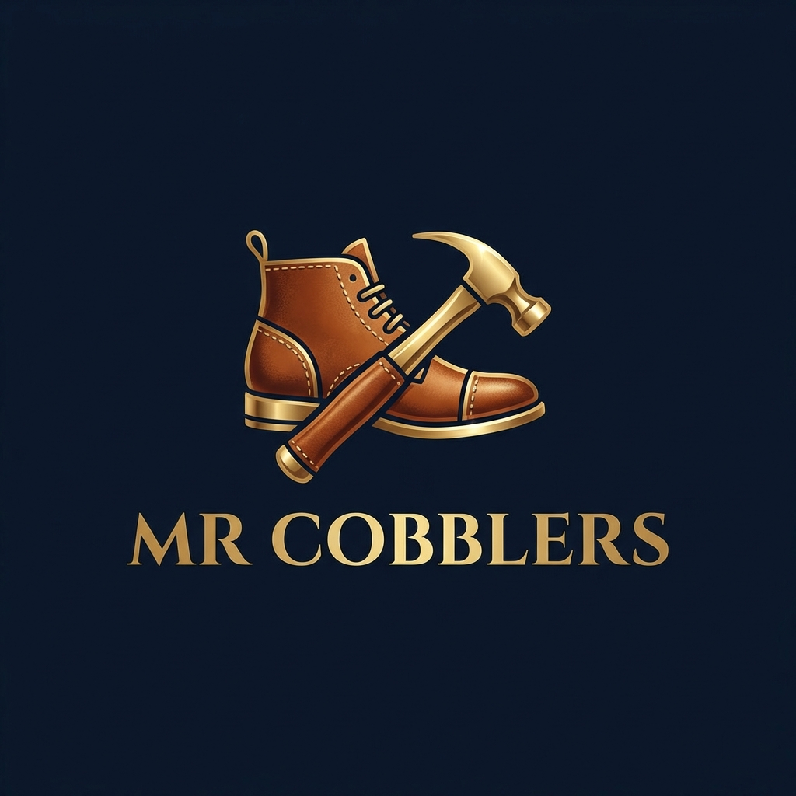

# MR Cobblers - Expert Leather Care Service

## 🛠️ About

**MR Cobblers** is a premium leather care service offering professional repair, cleaning, and restoration for all types of leather items including shoes, bags, belts, jackets, and accessories. We provide convenient doorstep pick-up and delivery service.

## ✨ Features

- **Free Pick-up & Drop Service** - Convenient doorstep collection and delivery
- **Expert Craftsmanship** - 15+ years of experience in leather repair
- **Complete Leather Care** - Shoes, bags, belts, jackets, and all leather items
- **Fast Turnaround** - Most repairs completed within 48-72 hours
- **100% Satisfaction Guarantee** - Quality assured or money back

## 🎨 Design

This website features a premium **leather-inspired design** with:
- Warm brown and tan color palette
- Authentic leather craftsmanship aesthetic
- Responsive, mobile-friendly layout
- Smooth animations and transitions
- Professional branding with custom logo

## 🚀 Technologies Used

- HTML5
- CSS3 (Custom styling with leather theme)
- Bootstrap 5.3
- Google Fonts (Inter & Outfit)
- AOS (Animate On Scroll)
- Bootstrap Icons

## 📱 Services Offered

1. **Shoes & Footwear** - Sole & heel repair, stitching, reinforcement
2. **Bags & Luggage** - Zipper replacement, handle repair, lining restoration
3. **Belts & Accessories** - Belt hole punching, buckle replacement, edge refinishing
4. **Jackets & Apparel** - Zipper repair, tear fixing, relining services
5. **Cleaning & Polish** - Deep cleaning, premium polish, stain removal
6. **Free Pick-up & Drop** - Same day pick-up, scheduled delivery, order tracking

## 📧 Contact

- **Phone**: +91 8801091101
- **Email**: info@mrcobblers.com
- **Location**: Hyderabad, Telangana

## 📄 License & Copyright

© 2026 MR Cobblers Pick-up & Drop. All rights reserved.

Logo © 2026 MR Cobblers - All Rights Reserved. Unauthorized use prohibited.

---

**Made with ❤️ for premium leather care**
